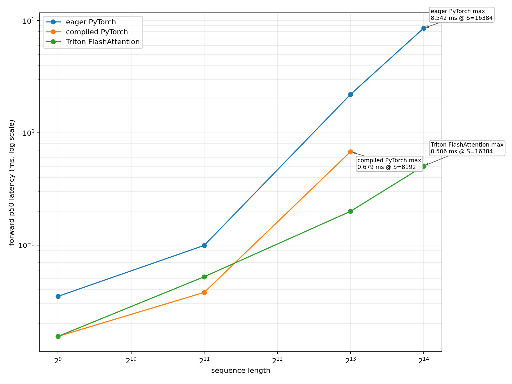
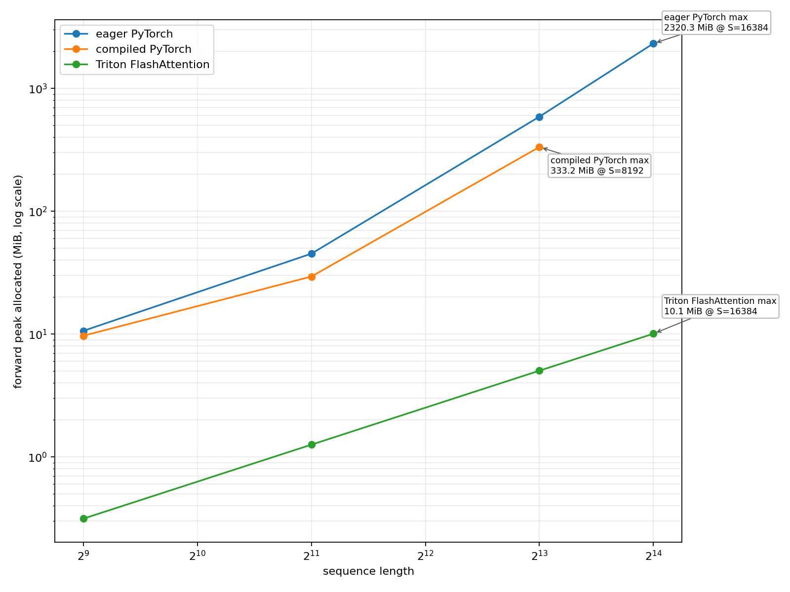

# A2-K 实验报告（基于 `results/` 的实际输出）

## 结论与合规审计

本次提交已经实现任务一至任务五要求的代码路径：activation checkpointing、显式 PyTorch
attention、`torch.compile` 对照、纯 PyTorch FlashAttention tiled forward/backward，以及
学生自写 Triton FlashAttention forward/backward。最新远端结果为：官方 attention 测试
**6 passed**，扩展 correctness **36/36 pass**，Flash benchmark **66/66 行 success**，
任务一 **7/7 行 success**，显式 attention **6/6 行 success**，compile comparison **8/8
行 success**。

结果满足本次代码和实验矩阵要求。设备 metadata 报告总显存约 48 GiB，但每个正式进程都
设置了 `23552 MiB`（23 GiB）PyTorch allocator 上限；本报告按固定 allocator 预算解释显存
数据，并保留硬件字段供复核。`memory_evidence.json` 的顶层峰值已正确汇总为所有正式进程
的最高值：`19623.67 / 19936.00 MiB`。
两个图表均已生成，附件大小约 52 KiB 和 56 KiB，远低于 guide 的附件限制。

正式环境 metadata：GPU 名称 `NVIDIA GeForce RTX 4090`，Driver `570.124.06`，P-state `P5`，
CUDA `12.8`，PyTorch `2.11.0+cu128`，Triton `3.6.0`，Python `3.12.3`；TF32 的 CUDA
matmul 和 cuDNN 开关均为 `False`。所有进程使用 23 GiB allocator 上限，Flash benchmark 的
commit 为 `5890454a042ef6db6a12c205ccf8a0a530cc6802`。

# 任务一：Activation Checkpointing

## 1. 理论分析（原题 3.2 / `gradient_checkpointing`）

### (a) 忽略计算代价时的最小峰值 activation memory

把 `N` 个 Transformer block 按近似等长的两半递归划分，并在每一层递归中分别对左右子区间调用 `checkpoint`，直到叶子区间只含一个 block；因此 checkpoint 是平衡、递归且嵌套的，而不是只在最外层切成若干非嵌套段。反向传播进入一个叶子 block 时，活跃内存主要由递归路径上每层的一份边界 activation 与该叶子重算出的 residual 构成，所以峰值 activation memory 为 `O(log N)`（不计参数、梯度、optimizer state，并按单个 block activation 为单位）。每一层递归都会让全部 `N` 个 block 总计再执行常数次，递归深度为 `O(log N)`，故包含重计算的总计算量为 `O(N log N)`。峰值出现在最深叶子区间的反向阶段：此时递归路径上的边界 activation 尚未释放，同时当前 block 的 residual 已被物化。

下面的代码骨架共 9 行，`checkpoint` 调用即为边界：

```python
from torch.utils.checkpoint import checkpoint

def nested_forward(blocks, lo, hi, x):
    if hi - lo == 1:
        return blocks[lo](x)                         # 叶子：物化一个 block 的 residual
    mid = (lo + hi) // 2
    x = checkpoint(lambda z: nested_forward(blocks, lo, mid, z), x,
                   use_reentrant=False)              # 左半区间边界（递归嵌套）
    x = checkpoint(lambda z: nested_forward(blocks, mid, hi, z), x,
                   use_reentrant=False)              # 右半区间边界（递归嵌套）
    return x
```

### (b) 一次重计算、禁止嵌套时的策略

令非嵌套 checkpoint 的 block size 为 `B`。前向结束后需要长期保存约 `ceil(N / B)` 个区间入口 activation，而反向处理某一区间时会短期物化约 `B` 层的 residual，因此忽略固定项后的峰值可写成 `M_peak(B) ≈ (N / B) A + B R`，其中 `A` 是一个边界 activation 的大小、`R` 是一层 residual 的大小；若只看渐近量级且 `A`、`R` 同阶，则最优 `B = Θ(sqrt(N))`，峰值为 `Θ(sqrt(N))`，总计算量仍为 `Θ(N)`（每层额外重算一次）。本任务使用 `N=24`，所以理论平衡点约为 `sqrt(24)≈4.9`；正式实验不预设答案，而是比较无 checkpoint 与 `B∈{1,2,4,8}`，再以实测 peak allocated 最低的成功配置参加 context length 2048 边界实验。

#### 实测结果

以下数字直接来自 `results/checkpointing.csv`；时间为 5 个 measurement steps 的 p50，显存为
独立进程中 measurement 区间的最高值。

| 配置 | p50 step (ms) | peak allocated (MiB) | peak reserved (MiB) | status |
|---|---:|---:|---:|---|
| context 1024, no checkpoint | 140.78 | 10046.13 | 10204 | success |
| context 1024, block 1 | 210.00 | 8096.54 | 8162 | success |
| context 1024, block 2 | 197.77 | 8096.54 | 8166 | success |
| context 1024, block 4 | 191.71 | 8096.54 | 8152 | success |
| context 1024, block 8 | 188.85 | 8096.54 | 8182 | success |
| context 2048, no checkpoint | 389.03 | 19623.67 | 19936 | success |
| context 2048, block 1 | 494.85 | 8094.93 | 9398 | success |

在 context 1024 上，block 1/2/4/8 的 `peak_allocated` 完全并列（约 8096.54 MiB）；脚本的
`min` 在并列时取第一项，所以选择 block 1 是 tie-break，而不是证据表明 block 1 比其他
block 更省显存。最新 context 1024 测量中 block 8 的 p50 最低（188.85 ms），但仍比无
checkpoint 慢约 34%。在 context 2048 边界上，block 1 把 peak allocated 从 19623.67 MiB
降到 8094.93 MiB（约减少 58.7%），代价是 p50 从 389.03 ms 增至 494.85 ms（约增加 27.2%）。

```bash
python -m student_scripts.a2k.benchmark_checkpointing
```

## 2. 实验设计与可复现性

实验脚本固定使用原题表 1 的 Stanford medium 配置：`d_model=1024`、`d_ff=4096`、24 层、16 heads，并按原题的非 leaderboard 设置使用 vocab size 10000。结合本仓库未绑定 embedding/lm-head 权重且每层采用 SwiGLU 的实现，模型共有 `423,183,360` 个参数（约 423.2M）；FP32 参数本身约占 1.576 GiB，参数、梯度和 AdamW 的两份 FP32 状态合计约 6.306 GiB，尚未包含 activation 与临时 workspace。

实验使用 batch size 1、FP32 参数、BF16 autocast 和 `torch.optim.AdamW`。每个配置都由父进程串行启动一个新的 Python 子进程；子进程在第一次 CUDA tensor/model/optimizer allocation 前设置 23 GiB allocator 上限，并检查当前是单张 RTX 4090 且开始时至少有 22 GiB 空闲显存。每个配置先做 3 个完整 warm-up training steps，再做 5 个 measurement steps；输入、targets 和 seed 在计时区间外固定创建，每次测量都在前后同步 CUDA，并在开始前重置 peak-memory statistics。

对 5 个 latency 原始样本报告 p50；CSV 中的 peak allocated 和 peak reserved 是 5 个独立重置区间中的最大值。标准矩阵完成后，脚本只依据 context 1024 成功行的 peak allocated 选择最佳 checkpoint block size，然后在独立进程中运行 context 2048 的无-checkpoint基线和该最佳配置；OOM 会作为结果行保留，不会被缩小 shape 或静默删除。脚本只负责生成 `results/checkpointing.csv`、`results/run_metadata.json` 和 `results/memory_evidence.json`，报告中的表格与结论在取得正式结果后另行分析撰写。

# 任务二：PyTorch Attention 与 `torch.compile`

## 1. 显式 PyTorch Attention

实验直接复用 `cs336_basics.model.scaled_dot_product_attention`；这是仓库自行实现的显式 PyTorch 函数，按顺序执行 `QK^T`、`1/sqrt(d)` scale、causal mask、softmax 和 `PV`，并非被禁止的 `torch.nn.functional.scaled_dot_product_attention` fused 接口。causal mask 与随机 `Q/K/V` 均在计时区间外创建；输入 shape 为 `[batch, sequence_length, head_dim]`，固定 batch size 1、BF16，并测试 `sequence_length∈{512, 2048, 8192}` 与 `head_dim∈{64, 128}` 的完整笛卡尔积。

baseline 脚本对 forward、backward-only 和 forward-backward 分别使用 `triton.testing.do_bench(warmup=100, rep=300, quantiles=[0.2, 0.5, 0.8])`。backward-only 复用一张保留的前向计算图并通过 `torch.autograd.grad(..., retain_graph=True)` 避免把重新前向或梯度累加计入该阶段；forward-backward 每次创建并消费一张新图。每个 shape 在新的 Python 子进程中运行，先设置 23 GiB allocator 上限并核验 RTX 4090 与起始空闲显存；OOM 仍写入 `results/attention_baseline.csv`，不会删除或缩小配置。

```bash
python -m student_scripts.a2k.benchmark_attention
```

## 2. `torch.compile` 对照

attention 对照固定使用 `(512, 64)`、`(2048, 128)`、`(8192, 128)`，eager 与 compiled 使用相同输入、dtype、causal mask、计时阶段和分位数定义。compiled attention 使用 `torch.compile(..., backend="inductor", fullgraph=True, dynamic=False)`；首次 compiled forward 与首次 compiled backward 分开同步计时，随后才测 steady-state latency。每个 compiled 配置使用独立且初始为空的 `TORCHINDUCTOR_CACHE_DIR` 与 `TRITON_CACHE_DIR`，避免跨 shape 或重复运行的磁盘缓存污染 cold-start 数字。

整模型对照使用 Stanford small 配置：vocab size 10000、`d_model=768`、`d_ff=3072`、12 层、12 heads、context length 512、batch size 1、FP32 参数与 BF16 autocast。模型级 compiled 版本使用 `fullgraph=False`，以便把实际 graph break 情况记录到 CSV；forward、backward-only、forward-backward 和包含 AdamW optimizer step 的完整 training step 各做 5 次 warm-up 与 10 次 CUDA-event measurements，并报告 p20/p50/p80。所有对照行和 graph counters 写入 `results/compile_comparison.csv`，环境、编译策略与测量边界写入 `results/run_metadata.json`。

```bash
python -m student_scripts.a2k.benchmark_compile
```

## 3. 实测结果

### 3.1 显式 Attention Baseline

`results/attention_baseline.csv` 的 6 个笛卡尔积配置均成功；下表为 p50（ms），显存是
forward-backward 测量区间的峰值。

| sequence | head dim | forward | backward | forward-backward | peak allocated / reserved (MiB) |
|---:|---:|---:|---:|---:|---:|
| 512 | 64 | 0.0348 | 0.2056 | 0.5888 | 19.88 / 26 |
| 512 | 128 | 0.0369 | 0.1894 | 0.6021 | 20.25 / 26 |
| 2048 | 64 | 0.1024 | 0.1946 | 0.4752 | 69.77 / 84 |
| 2048 | 128 | 0.1085 | 0.1966 | 0.4474 | 71.27 / 86 |
| 8192 | 64 | 2.1903 | 4.8353 | 6.9448 | 854.33 / 862 |
| 8192 | 128 | 2.2221 | 4.8783 | 7.0236 | 860.33 / 982 |

### 3.2 Eager 与 Compiled Attention

| shape | implementation | cold-start total (s) | forward p50 (ms) | backward p50 (ms) | forward-backward p50 (ms) | peak reserved (MiB) |
|---|---|---:|---:|---:|---:|---:|
| 512×64 | eager | — | 0.0349 | 0.1833 | 0.4588 | 26 |
| 512×64 | compiled | 27.916 | 0.0154 | 0.0320 | 0.2683 | 24 |
| 2048×128 | eager | — | 0.1055 | 0.2406 | 0.5715 | 86 |
| 2048×128 | compiled | 3.484 | 0.0471 | 0.1014 | 0.2612 | 66 |
| 8192×128 | eager | — | 2.2149 | 4.8765 | 7.0236 | 982 |
| 8192×128 | compiled | 3.903 | 0.7117 | 1.9392 | 2.5989 | 542 |

compiled attention 的 steady-state forward-backward 相对 eager 分别约为 1.71×、2.19× 和
2.70×；但 512×64 的 cold-start 约 27.92 s，明显远大于其亚毫秒 steady-state latency。
这组 `dynamic=False`、独立缓存、固定 shape 的结果不能外推到动态 shape 或首次调用延迟。

### 3.3 Eager 与 Compiled Stanford Small 模型

| implementation | forward p50 (ms) | backward p50 (ms) | forward-backward p50 (ms) | training step p50 (ms) | peak reserved (MiB) | status |
|---|---:|---:|---:|---:|---:|---|
| eager | 17.108 | 28.681 | 48.220 | 59.173 | 2822 | success |
| compiled | 5.135 | 7.529 | 13.342 | 26.295 | 2774 | success |

compiled 模型的 cold-start 为 36.09 s（forward 26.42 s、backward 9.67 s），steady-state
forward/backward/forward-backward/training-step 相对 eager 分别约为 3.33×、3.81×、3.61×、
2.25×。peak reserved 从 2822 MiB 降至 2774 MiB。编译一致性使用 `rtol=0.01`、`atol=0.015`，
8/8 compile comparison 行均成功；该容差是针对 BF16/Inductor 累加顺序误差的明确记录，不能
与严格 FP32 bitwise 一致性混同。该行的 Dynamo counters 为 `graph_break_count=0`、
`unique_graph_count=1`。

## 4. 结果分析

<!-- 原分析检查项已由下方实际结果替代：
1. latency 随 sequence length/head dimension 的变化，以及 forward、backward、forward-backward 的关系；
2. 最早 OOM 配置的显存核算，以及二次方 attention score/softmax 保存量随 sequence length 的变化；
3. compiled 的 cold-start 与 steady-state 收益，不能只写“compiled 更快”；
4. graph break、固定 shape specialization、独立编译缓存与测量稳定性；
5. attention microbenchmark 与整模型/optimizer step 的收益差异。
-->

显式 eager attention 在 sequence 由 2048 增至 8192 时，forward-backward p50 从约 0.45 ms
增至约 7.0 ms，同时 peak reserved 从 84--86 MiB 增至 862--982 MiB，体现了显式
`QKᵀ`/softmax 中间量的二次方空间增长。head dimension 从 64 增至 128 的影响小于
sequence length 的影响，但会增加 score/value 相关计算和显存。

`torch.compile` 的收益主要出现在 steady-state；首次编译成本必须单独报告。整模型在放宽到
BF16 合理绝对容差后成功完成，training step p50 从 59.17 ms 降到 26.30 ms，约 2.25×；
这个收益小于 attention microbenchmark 的部分 shape，说明模型编译、反向和 optimizer step
仍会引入额外边界。编译结果使用固定 shape、`dynamic=False` 和独立缓存，不能外推到动态 shape
或首次调用延迟。

# 任务三：FlashAttention-2 前向

实现位于 `cs336_systems/a2k/attention.py`，并通过 `tests/adapters.py` 暴露
`FlashAttentionPyTorch` 与 `FlashAttentionTriton` 两个 `torch.autograd.Function`。两条路径
接口均为 `apply(Q, K, V, is_causal=False)`，支持 `[batch, sequence, head_dim]` 输入和
causal/non-causal；前向保存 `Q/K/V/O` 及唯一一个 `[batch, n_queries]` 的 FP32
log-sum-exp `L`。

PyTorch reference 逐个 `128×128` tile 维护 FP32 行级 running maximum `m`、normalizer
`l` 与 output accumulator：

```text
m' = max(m, rowmax(S)); P̃ = exp(S - m')
l' = exp(m - m')l + rowsum(P̃)
O' = exp(m - m')O + P̃V; L = m' + log(l')
```

Triton 路径使用自写 `@triton.jit flash_fwd_kernel`：一个 program instance 负责一个
query tile 与 batch index，kernel 内仅循环 key/value tiles；`m/l/accumulator` 均使用 FP32。
BF16 性能路径的 launch 配置是 query/key tile `64/64`、`num_warps=4`、`num_stages=2`；为
避免 FP32 扩展正确性配置在 d=128 时超过 RTX 4090 的 shared-memory 上限，FP32 路径自动
使用 `32/32`、`num_warps=2`、`num_stages=1`。causal mask 用全局 query/key index 比较，
masked score 为题面规定的 `-1e6`。

远端复现（实际远端 runner 为 `python`，以下 `uv run` 是脚本默认命令）：

```bash
python -m pytest tests/test_attention.py -v
python -m student_scripts.a2k.check_flash_attention
```

官方 CUDA 输出保存在 `results/unit_tests.txt`：`tests/test_attention.py` 共 6 项，6 passed、
0 failed、0 skipped，用时 9.04 s；其中 PyTorch/Triton forward 和 PyTorch/Triton backward
的 causal/non-causal 测试均通过。扩展 correctness 共 36 条记录（2 implementations ×
3 seeds × 3 head dimensions × 2 mask settings），36/36 pass，dtype 为 FP32，容差为
`rtol=atol=0.01`。

correctness 的最大误差如下；最大相对误差主要来自接近零的梯度元素，因此同时报告绝对误差
和 `torch.allclose` 的 pass/fail：

| implementation | max abs over all checks | max rel over all checks | status |
|---|---:|---:|---|
| PyTorch tiled | 1.91e-6 | 0.363 | 18/18 pass |
| Triton FlashAttention | 3.52e-3 | 1326.154 | 18/18 pass |

Triton 的最大绝对误差仍低于 `atol=0.01`；相对误差较大不代表整体输出失真，因为对应参考
值非常接近零。完整的每个 seed、shape、mask、`O/L/dQ/dK/dV` 误差保存在
`results/correctness.json`。

# 任务四：FlashAttention-2 重计算反向

纯 PyTorch 路径使用 `flash_attention_backward`；Triton 路径使用三个自写 kernel，均只由保存的
`L` 和输入/输出重算而不保存 attention probability matrix：

```text
D = rowsum(O ⊙ dO); P = exp(QKᵀ / √d - L)
dV = PᵀdO; dS = P ⊙ (dOVᵀ - D)
dQ = dSK / √d; dK = dSᵀQ / √d
```

Triton 先计算 FP32 `D = rowsum(O ⊙ dO)`；随后按 Algorithm 2 分两遍重算 `P`：一个 key-tile
program 独立累加并写回 `dK/dV`，另一个 query-tile program 独立累加并写回 `dQ`。因此不需要
跨 program 同步或 atomic，且瞬时 score/probability 仅为一个 tile。causal 反向复用与前向相同
的 mask，返回梯度顺序为 `Q/K/V/is_causal`。

Triton backward 的 `D`、`dK/dV`、`dQ` 三个 kernel 均参与正式 benchmark；官方 CUDA backward
测试的 causal/non-causal 两行全部通过。扩展 correctness 中 Triton 的 dQ/dK/dV 最大绝对误差
分别为 `3.33e-3`、`3.45e-3`、`3.52e-3`，均在 FP32 correctness 容差内。

# 任务五：正确性与性能矩阵

`student_scripts/a2k/benchmark_flash_attention.py` 以 implementation/shape 独立子进程测量
核心矩阵（BF16、batch size 1、causal、sequence length `512/2048/8192`、head dimension
`64/128`）的 eager PyTorch、compiled PyTorch 与 Triton 的 forward、backward、forward-backward。
16384 边界矩阵比较 eager 与 Triton；每行记录 `do_bench(warmup=100, rep=300)` 的
p20/p50/p80、peak allocated/reserved、同 shape eager speedup、status，及 Triton launch
参数；OOM 行会保留。

```bash
python -m student_scripts.a2k.benchmark_flash_attention
```

也可以在远端 GPU 上用一条命令串行运行任务一至任务五；测试输出会脱敏后写入
`results/unit_tests.txt`：

```bash
bash student_scripts/a2k/run_all_experiments.sh
```

矩阵已完成：核心 6 shapes × 3 implementations × 3 phases = 54 行，16384 边界 2 shapes ×
2 implementations × 3 phases = 12 行，合计 66/66 success，无 OOM。`assets/flash_latency.png`
和 `assets/flash_memory.png` 已由脚本生成。

### 5.1 核心矩阵摘要（forward-backward p50）

下表是 `results/flash_benchmark.csv` 的摘要；完整 forward、backward、forward-backward
三阶段和 p20/p80 分位数保留在 CSV 中。显存列为 peak reserved MiB；speedup 均相对于同一
shape 的 eager 行。

| sequence × head dim | eager ms / MiB | compiled ms / MiB | Triton ms / MiB | Triton speedup |
|---|---:|---:|---:|---:|
| 512×64 | 0.5652 / 26 | 0.2683 / 24 | 0.0492 / 2 | 11.50× |
| 512×128 | 0.4659 / 26 | 0.3000 / 24 | 0.1516 / 2 | 3.07× |
| 2048×64 | 0.5316 / 84 | 0.3635 / 64 | 0.1679 / 4 | 3.17× |
| 2048×128 | 0.4772 / 86 | 0.2632 / 66 | 0.3215 / 6 | 1.48× |
| 8192×64 | 6.9407 / 862 | 2.5293 / 478 | 0.6492 / 10 | 10.69× |
| 8192×128 | 7.0246 / 982 | 2.5999 / 490 | 1.2595 / 22 | 5.58× |

完整实测行（包括三个 phase 的 p20/p50/p80）均保留在 CSV 中。

### 5.2 16384 边界（forward-backward p50）

| shape | eager ms / MiB | Triton ms / MiB | Triton speedup |
|---|---:|---:|---:|
| 16384×64 | 27.5840 / 3862 | 2.0879 / 22 | 13.21× |
| 16384×128 | 27.7719 / 3882 | 4.9254 / 42 | 5.64× |

长序列上 Triton 不保存完整 `S/P` 矩阵，因此显存和 eager 的差距扩大；例如 16384×64 的
peak reserved 从 3862 MiB 降至 22 MiB，同时 forward-backward 加速约 13.21×。

两张图均以 head dimension 64 的 forward p50 为纵轴，并改用对数 y 轴；每条曲线的最大值
都用箭头直接标注，避免 Triton 曲线因数量级较小而贴在底部不可读。对应最大值为：latency
方面 eager 8.542 ms（S=16384）、compiled 0.679 ms（S=8192）、Triton 0.506 ms（S=16384）；
显存方面 eager 2320.3 MiB（S=16384）、compiled 333.2 MiB（S=8192）、Triton 10.1 MiB
（S=16384）。




