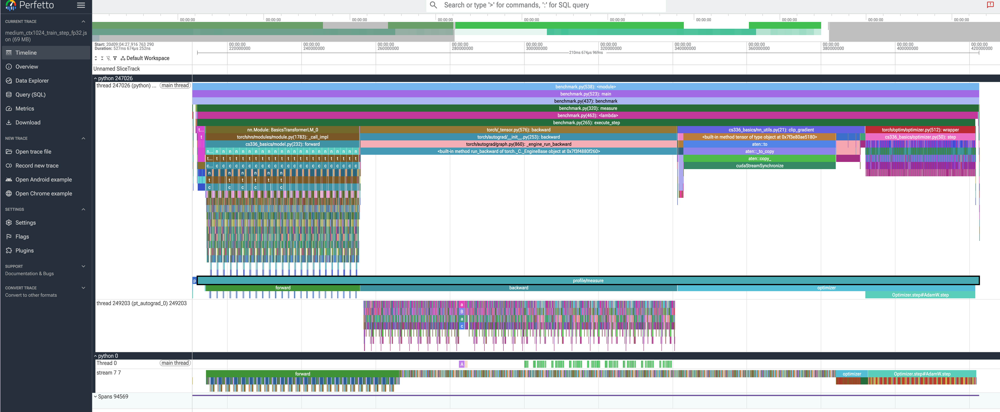
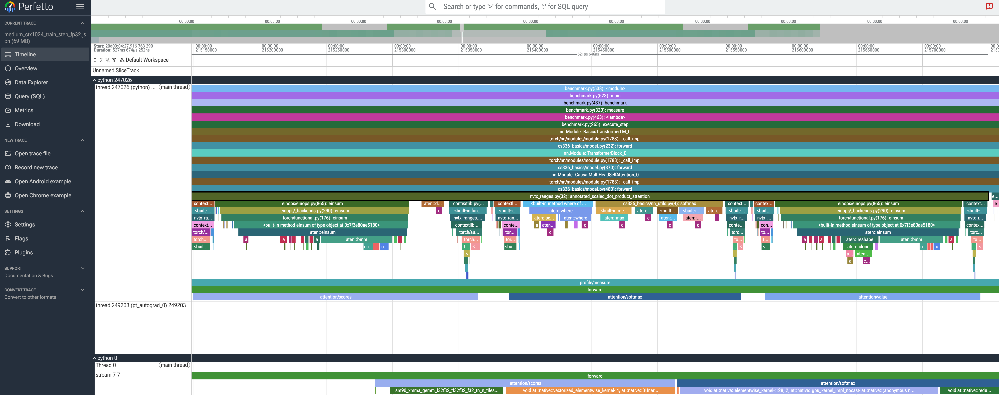
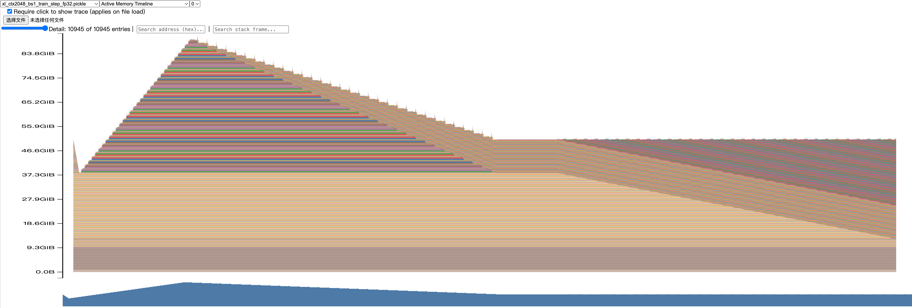

# 性能分析与基准测试报告

本报告遵循 [`docs/guide.md`](docs/guide.md) 的测量口径，所有表中数值均可回溯至 [`results/`](results/) 下的轻量、脱敏结果文件。完整 Chrome trace 和 PyTorch memory snapshot 仅保存在已忽略的本地目录中，不进入提交物。

## 1. 环境、范围与代码入口

本次结果来自同一套公开环境记录：NVIDIA H200、CUDA 12.8、PyTorch `2.11.0+cu128`、Python 3.12.3。所有实验固定 seed 为 0；除特别说明的零预热对照外，基准测试均使用 5 个 warm-up step 与 10 个 measurement step。模型初始化、优化器创建和随机 batch 构造均发生在计时区间之前。

统一入口为 [`profiling/benchmark.py`](profiling/benchmark.py)。它用 `torch.cuda.Event` 包围被测 workload，并在读取每个 elapsed time 前执行 `torch.cuda.synchronize()`；因此表中的端到端时间不包含未完成的异步 CUDA 工作。`forward` 使用 `eval()` 与 `torch.no_grad()`，`forward_backward` 在每步清理梯度并执行前向、loss 和反向，`train_step` 还包括 `zero_grad`、优化器更新和梯度裁剪。

本次提交前进行了只读复核：

- `profiling/trace_summary.py --check` 验证了 6/6 份 trace、1,595 行汇总和 6 份 metadata；
- `profiling/repair_results.py --status` 显示 Task 2、Task 3 和 Task 4 的修复产物均完成；
- `tests/test_profiling.py` 与 `tests/test_repair_results.py` 共 28 个测试均通过。

主要证据文件如下：

- Task 1：[`results/benchmark.csv`](results/benchmark.csv) 与 [`results/benchmark/raw.jsonl`](results/benchmark/raw.jsonl)；
- Task 2：[`results/profile/trace_summary.csv`](results/profile/trace_summary.csv)、[`results/profile/run_metadata.json`](results/profile/run_metadata.json) 与 [`results/profile/runs.jsonl`](results/profile/runs.jsonl)；
- Task 3：[`results/mixed_precision.json`](results/mixed_precision.json)、[`results/mixed_precision_benchmark.csv`](results/mixed_precision_benchmark.csv) 与 [`results/mixed_precision_benchmark.jsonl`](results/mixed_precision_benchmark.jsonl)；
- Task 4：[`results/memory/peaks.csv`](results/memory/peaks.csv)、[`results/memory/run_metadata.json`](results/memory/run_metadata.json)、[`results/memory/runs.jsonl`](results/memory/runs.jsonl) 与 [`results/memory/failures.jsonl`](results/memory/failures.jsonl)。

除另行标注外，时间单位为 ms；显存单位为 GiB（`bytes / 2^30`）；表中的“均值 ± 标准差”均由 10 条原始 timing 计算，标准差为样本标准差。

## 2. 端到端基准测试

基线配置为 small、batch size 4、context length 512、FP32。四项结果如下；每一行都有完整的 10 条原始 timing，可在 [`raw.jsonl`](results/benchmark/raw.jsonl) 中复核。

| 模式 | warm-up steps | 时间（ms，均值 ± 标准差） | CV |
|---|---:|---:|---:|
| `forward` | 5 | 8.732 ± 0.022 | 0.257% |
| `forward_backward` | 5 | 30.983 ± 0.073 | 0.237% |
| `train_step` | 5 | 41.769 ± 0.882 | 2.112% |
| `train_step` | 0 | 63.491 ± 68.226 | 107.458% |

在完成 warm-up 的稳定测量中，`forward_backward - forward` 为 22.251 ms，反映 loss 与反向传播带来的端到端增量；`train_step - forward_backward` 为 10.785 ms，包含梯度清理、优化器和梯度裁剪的额外工作。二者来自独立端到端运行，因此只能作为 workload 增量，不应误解为某个孤立 kernel 的精确耗时。

零预热的 `train_step` 首个样本为 257.622 ms，而随后样本已接近 41–46 ms；这使其平均值达到稳定版本的 1.52 倍，且 CV 达到 107.458%。这正是 CUDA context、惰性库初始化、算法选择、缓存分配器增长和首次优化器状态分配会污染正式测量的原因，也是将 5 个预热 step 排除在统计之外的必要性。

可复现实验命令为：

```bash
uv run python profiling/collect_benchmark.py
```

## 3. 计算性能分析

### 3.1 Trace 协议与汇总口径

使用 `torch.profiler` 同时采集 CPU 与 CUDA activity。矩阵为 small 与 medium 两种模型、context length 256/512/1024 三种长度，即 2 × 3 共 6 个 FP32 `train_step` trace；batch size 固定为 4。每个 trace 在 profiler 外执行 4 个预热 step，在 profiler 内保留 1 个明确标记为 `profile/warmup` 的预热 step，然后只捕获 1 个 `profile/measure` 稳定 step。

原始 trace 中每个 run 都有且仅有一个 `profile/warmup` 和一个 `profile/measure` annotation。公开的 [`trace_summary.csv`](results/profile/trace_summary.csv) 则**只**统计 `profile/measure` 内的事件：这是为了避免 profiler 内的预热 step 混入正式结果，并非丢失了 warm-up 标记。CSV 将 CPU annotation range、CPU op 和物理 CUDA activity 分为 `range`、`cpu_op`、`cuda_activity` 三种行；GPU kernel、memcpy 和 memset 通过 External id 关联至 CPU op 后归属到 `forward`、`backward` 或 `optimizer`。因此不会把同名 CPU/GPU annotation 双重计数，也不会把 GPU user annotation 误当作阶段 CUDA 耗时。

所有 6 份 metadata 都记录了相对 trace 文件名、模型、context、batch、精度、命令、4+1 预热协议以及 H200/CUDA/PyTorch/Python 环境；其中没有绝对路径、用户名或主机信息。

### 3.2 六个稳定 measurement step

下表左半部分是 CUDA Event 的端到端 step 时间和 CPU annotation range；右半部分是按阶段归属的**累计物理 GPU activity 时间**。后者可能有 stream 重叠，不能与 CPU range 或彼此相加后当成 GPU 墙钟时间。

| 模型 | context | CUDA Event step | `profile/measure` CPU range | forward CPU range | backward CPU range | optimizer CPU range | forward GPU activity | backward GPU activity | optimizer GPU activity |
|---|---:|---:|---:|---:|---:|---:|---:|---:|---:|
| small | 256 | 75.949 | 76.371 | 21.374 | 31.831 | 20.989 | 3.930 | 10.416 | 7.860 |
| small | 512 | 74.103 | 74.234 | 20.820 | 31.284 | 20.335 | 7.851 | 19.013 | 7.878 |
| small | 1024 | 90.717 | 90.863 | 21.501 | 32.456 | 35.077 | 19.073 | 44.114 | 7.885 |
| medium | 256 | 142.834 | 142.971 | 38.008 | 63.266 | 38.439 | 9.516 | 24.882 | 21.004 |
| medium | 512 | 145.151 | 145.290 | 39.436 | 63.720 | 38.889 | 19.647 | 47.187 | 21.028 |
| medium | 1024 | 210.532 | 210.675 | 41.607 | 85.446 | 80.330 | 49.371 | 113.683 | 21.051 |

从 context 256 增长到 1024 时，small 的 forward/backward 累计 GPU activity 分别由 3.930/10.416 ms 增至 19.073/44.114 ms；medium 对应由 9.516/24.882 ms 增至 49.371/113.683 ms。增长主要落在依赖序列长度的计算与反向传播上，而 optimizer 的累计 GPU activity 在同一模型规模内基本稳定：small 约 7.9 ms、medium 约 21.0 ms。这与 optimizer 主要随参数量而非 context length 变化相符。

### 3.3 代表性配置：medium、context 1024

在 `medium_ctx1024_train_step_fp32` 中，`backward` 的累计物理 GPU activity 为 113.683 ms，超过 `forward` 的 49.371 ms 和 `optimizer` 的 21.051 ms。按累计 GPU activity 排序的代表性 kernel 条目如下；名称为 trace 中的简写，Calls 为实际 kernel calls。

| 归属阶段 | 物理 CUDA activity（简写） | Calls | 累计 GPU activity（ms） |
|---|---|---:|---:|
| backward | `elementwise_kernel` | 72 | 16.613 |
| backward | `vectorized_elementwise_kernel` | 340 | 15.433 |
| backward | TF32 GEMM（NT） | 72 | 10.006 |
| forward | TF32 GEMM（TN） | 168 | 9.033 |
| backward | 向量化 add kernel | 315 | 8.527 |

该配置有 24 层 attention 子范围。`attention/scores`、`attention/softmax`、`attention/value` 的累计 CPU range 分别为 3.612、3.551、3.220 ms，每项各调用 24 次。它们是 `forward` 41.607 ms CPU range 内的 inclusive 嵌套范围，**不能**与 forward 相加；这样避免把 attention 的嵌套工作重复计入阶段总量。可观察到 backward 中既有 TF32 GEMM，也有大量逐元素和向量化逐元素 kernel，因此其累计 activity 明显更高，而这不等同于一个可直接相加的阶段墙钟时间。

图 1 是同一 `medium_ctx1024_train_step_fp32` measurement step 的 Perfetto 总览。它将主线程、`pt_autograd_0` worker 与 GPU 0 的 stream 7 同时保留；黑框中的 `profile/measure` 只覆盖正式 measurement step，包含 `forward`、`backward` 与 `optimizer`。因此它可用于解释 CPU 标记、Autograd worker 和实际 GPU stream 不必严格按相同父子层级显示的原因。



*图 1：medium、context 1024、batch size 4、FP32 `train_step` 的 Perfetto measurement-step 总览。时间单位显示在 timeline 标尺中；图中没有使用 warm-up 区间作正式归因。*

图 2 放大了同一 trace 的一个 attention 子区间。`attention/scores`、`attention/softmax` 与 `attention/value` 在 CPU annotation 和 GPU stream 中均可见，支持上文对它们是 forward 内嵌范围、而非可与 forward 直接相加的独立墙钟阶段的说明。



*图 2：与图 1 相同配置下的 attention 细节；展示一个 `scores → softmax → value` 子序列及其 GPU kernel 活动。*

可重新采集六个 trace 的命令为：

```bash
uv run python profiling/collect_profiles.py
```

## 4. 混合精度

### 4.1 固定累加误差实验

以下四种写法均执行 1,000 次 `0.01` 累加，结果来自 [`mixed_precision.json`](results/mixed_precision.json)。

| 累加器 dtype | 输入 dtype / 转换 | 最终值 | 相对 10 的绝对误差 |
|---|---|---:|---:|
| FP32 | FP32 | 10.0001335144 | 0.0001335144 |
| FP16 | FP16 | 9.9531250000 | 0.0468750000 |
| FP32 | FP16 | 10.0021362305 | 0.0021362305 |
| FP32 | FP16 后显式转换为 FP32 | 10.0021362305 | 0.0021362305 |

FP16 累加器在每次加法后都以 FP16 舍入，故误差最大。后两种 FP32 累加器得到完全相同的结果：显式转换不能恢复已经被 FP16 量化的 `0.01`，但可避免后续每次累加继续以低精度舍入。因而两类误差必须区分：输入量化造成约 0.002136 的偏差，而低精度累加器会额外放大误差。

### 4.2 ToyModel 的 BF16 autocast dtype

| 张量或结果 | 实际 dtype |
|---|---|
| 参数 | FP32 |
| `fc1` 输出 | BF16 |
| LayerNorm 输出 | FP32 |
| logits | BF16 |
| loss | FP32 |
| gradient | FP32 |

该结果说明 autocast 不是把整个训练图机械地转换为 BF16：矩阵计算友好的路径可以使用 BF16，而 LayerNorm、loss、参数和梯度等数值更敏感或需要保持主副本的部分仍使用 FP32。

### 4.3 FP32 与 BF16 性能和峰值分配

下表中的峰值为每个独立基准记录的 `peak_allocated_bytes`，均为 batch size 4、context length 512、warm-up 5、measurement 10。原始 timing、CV 和显存字段可在 [`mixed_precision_benchmark.csv`](results/mixed_precision_benchmark.csv) 逐行复核；20 条记录均完成，失败文件为空。

| 模型 | 模式 | FP32（ms，均值 ± 标准差） | BF16（ms，均值 ± 标准差） | BF16 加速 | FP32 / BF16 峰值 allocated（GiB） |
|---|---|---:|---:|---:|---:|
| small | `forward` | 8.678 ± 0.028 | 8.361 ± 0.038 | 3.66% | 0.735 / 0.912 |
| small | `forward_backward` | 30.952 ± 0.069 | 27.955 ± 0.070 | 9.68% | 4.107 / 3.289 |
| medium | `forward` | 21.207 ± 0.028 | 20.771 ± 0.052 | 2.05% | 1.907 / 2.565 |
| medium | `forward_backward` | 72.832 ± 1.013 | 63.061 ± 0.214 | 13.42% | 10.611 / 8.469 |
| large | `forward` | 40.214 ± 0.023 | 38.180 ± 0.086 | 5.06% | 4.120 / 5.767 |
| large | `forward_backward` | 143.735 ± 0.105 | 116.668 ± 0.074 | 18.83% | 20.312 / 16.646 |
| XL | `forward` | 79.706 ± 3.303 | 65.408 ± 0.079 | 17.94% | 13.466 / 19.426 |
| XL | `forward_backward` | 289.756 ± 0.958 | 214.580 ± 0.104 | 25.94% | 40.201 / 37.335 |
| 10B | `forward` | 235.512 ± 8.664 | 174.502 ± 2.499 | 25.91% | 48.807 / 72.024 |
| 10B | `forward_backward` | 874.425 ± 1.018 | 597.212 ± 0.874 | 31.70% | 104.145 / 109.933 |

BF16 在 10 组配对中都更快，且模型越大、工作量越接近完整反向，收益越明显：small 的增益为 3.66%–9.68%，而 10B 为 25.91%–31.70%。这与 H200 上 Tensor Core 对低精度矩阵计算的支持相符。

然而，不能从这些数据推出“BF16 必然降低峰值显存”。本实验所有 `forward` 配对的 BF16 `peak_allocated` 都更高，10B 的 `forward_backward` 也更高；原因可能包括 FP32 参数主副本、autocast 产生的转换/caching、数值敏感算子的保留精度、算法 workspace 和缓存分配器行为。峰值 allocator 指标必须与实际配置一起解释，不能仅根据 dtype 预设结论。

### 4.4 10 步 FP32–BF16 数值趋势

数值诊断使用 small、`train_step`、batch size 4、context length 512、seed 0、warm-up 5、measurement 10。两条路径从同一份 CPU FP32 `state_dict` 初始化，使用相同的固定 token/target 和独立但超参数相同的 AdamW；每个观测发生在优化器更新之前。10/10 步的 loss 与 logits 全部为有限值。

| 测量步 | FP32 loss | BF16 loss | loss 相对差 | logits 相对 L2 误差 | top-1 一致率 |
|---:|---:|---:|---:|---:|---:|
| 1 | 6.024629 | 6.016376 | 0.1370% | 1.3575% | 99.6094% |
| 2 | 5.498358 | 5.479193 | 0.3486% | 2.1409% | 99.9512% |
| 3 | 4.530469 | 4.533494 | 0.0668% | 1.1796% | 99.9023% |
| 4 | 4.091228 | 4.085101 | 0.1498% | 2.7759% | 100.0000% |
| 5 | 2.852689 | 2.842694 | 0.3504% | 2.6044% | 99.9512% |
| 6 | 2.038127 | 2.034716 | 0.1674% | 1.7201% | 100.0000% |
| 7 | 1.615154 | 1.611528 | 0.2245% | 1.4215% | 100.0000% |
| 8 | 1.359669 | 1.355864 | 0.2799% | 1.2014% | 100.0000% |
| 9 | 1.198286 | 1.195675 | 0.2179% | 0.9254% | 100.0000% |
| 10 | 1.094847 | 1.092791 | 0.1878% | 0.7295% | 99.8535% |

完整逐步记录和 min/mean/max 汇总都在 [`language_model_numeric_trend`](results/mixed_precision.json) 中。其平均绝对 loss 差为 0.006207，平均/最大 loss 相对差为 0.21298%/0.35035%；logits RMSE 平均值为 0.012271，logits 相对 L2 误差平均/最大值为 1.60562%/2.77588%；top-1 一致率平均值为 99.92676%，最低值为 99.60938%。loss 从约 6 降至约 1.09，且没有 NaN/Inf，因此在这个固定短诊断中没有数值发散的迹象；这不是对更长训练或不同超参数的一般性保证。

可重新采集此任务的命令为：

```bash
uv run python profiling/collect_mixed_precision.py
```

## 5. 显存分析

### 5.1 协议与成功配置

专项显存实验使用 XL（3,406,809,600 个参数）、FP32/BF16、context length 128/2048、`forward`/`train_step`。每个 run 先完成 5 个 warm-up step，再重置峰值统计、启用 memory history，并记录 1 个 measurement step 与独立 snapshot metadata。`active`、`allocated` 和 `reserved` 始终分列报告；本批部分记录中前两者恰好数值相同，但这不是一般定义上的等价关系。

下表列出 8 条成功记录的峰值。context 2048 的 `train_step` 原始请求 batch size 为 4；发生 OOM 后按规定使用 batch size 1 作为如实标记的 fallback，而没有把它冒充为 batch size 4 结果。

| context | batch | 模式 | dtype | 峰值 active（GiB） | 峰值 allocated（GiB） | 峰值 reserved（GiB） |
|---:|---:|---|---|---:|---:|---:|
| 128 | 4 | `forward` | FP32 | 12.931 | 12.931 | 12.947 |
| 128 | 4 | `train_step` | FP32 | 51.462 | 51.462 | 57.455 |
| 2048 | 4 | `forward` | FP32 | 21.323 | 21.323 | 23.477 |
| 2048 | 1 | `train_step` | FP32 | 91.209 | 91.209 | 93.051 |
| 128 | 4 | `forward` | BF16 | 19.168 | 19.168 | 19.400 |
| 128 | 4 | `train_step` | BF16 | 51.451 | 51.451 | 58.395 |
| 2048 | 4 | `forward` | BF16 | 25.375 | 25.375 | 27.477 |
| 2048 | 1 | `train_step` | BF16 | 82.548 | 82.548 | 84.307 |

XL 的一份 FP32 residual stream 张量若具有 `(batch, context, d_model) = (4, L, 2560)` 形状，其理论大小为 `4 × L × 2560 × 4` bytes：context 128 时为 5 MiB，context 2048 时为 80 MiB；batch size 1、context 2048 时为 20 MiB。单个张量远小于完整峰值，但深层网络会同时保留多层激活，长 context 的 attention 工作区也随序列长度迅速增长。另一个重要基线是 XL 的 FP32 参数主副本约为 12.691 GiB；若在完整训练中粗略考虑参数、梯度和 AdamW 的两个状态，四份 FP32 张量约为 50.765 GiB，已接近 context 128、batch 4 的 51.462 GiB 峰值。这解释了完整训练步为何远高于纯前向，剩余差额来自激活、临时工作区和分配器碎片等。

图 3 与表中的 XL/context 128/batch 4/FP32 `forward` 行对应。Active Memory Timeline 的稳定平台约为参数主副本量级，和该行 12.931 GiB 的 peak active/allocated 及 12.947 GiB 的 peak reserved 口径一致。


*图 3：XL、context 128、batch size 4、FP32 `forward`。图为 5 个 warm-up 后启用 memory history 的 Active Memory Timeline；纵轴单位为 GiB。*

图 4 对应 XL/context 2048/FP32 `train_step` 的 batch-1 fallback。图中的峰值和大段活跃 allocation 高于纯前向，符合参数、梯度、AdamW 状态和激活同时存活的完整训练步特征；它必须与表中 91.209 GiB 的 batch-1 记录对应，不能当作原始 batch-4 请求的结果。



*图 4：XL、context 2048、batch size 1、FP32 `train_step` 的 Active Memory Timeline。batch size 1 是记录在 `failures.jsonl` 中的 batch-4 OOM 后的如实 fallback。*

### 5.2 原始 batch 4 长 context 的 OOM

两条失败记录完整保留了原始配置：XL、context 2048、batch size 4、`train_step`，分别为 FP32 和 BF16。两者均在 warm-up 的 forward phase 发生 `cuda_oom`，`peak_scope` 也明确为 `warmup`，因此没有被误写为“预热后 measurement 峰值”。结构化 telemetry 全部可用，且没有保存原始异常文本、路径、用户名或 stderr。

| dtype | 失败前可用显存（GiB） | 请求分配（GiB） | 峰值 active（GiB） | 峰值 reserved（GiB） | 设备总显存（GiB） |
|---|---:|---:|---:|---:|---:|
| FP32 | 1.609 | 2.000 | 135.984 | 137.572 | 139.812 |
| BF16 | 0.443 | 2.000 | 138.363 | 138.699 | 139.812 |

两种精度都需要再申请 2 GiB，但失败前分别只剩 1.609 GiB 和 0.443 GiB 可用，故 OOM 与 telemetry 一致。BF16 在此处也没有天然更低的 warm-up 峰值；这与第 4 节的 allocator 峰值现象一致，说明必须按照实际 autocast、workspace 与缓存行为解读，而不是只依据数据类型作推断。

每条成功记录都有 snapshot 文件名记录在 `runs.jsonl` 和 `run_metadata.json` 中；完整 snapshot 仍留在本地忽略目录，不进入公开提交。可重新采集此任务的命令为：

```bash
uv run python profiling/collect_memory.py
```

## 6. 局限、剩余证据与复现

### 6.1 已完成的数据验收

- Task 1：4 个必需基线记录均有 10 条原始 timing、均值、样本标准差和 CV；
- Task 2：六个 `train_step` measurement-only trace 汇总完整，所有 metadata 都包含 H200/CUDA/PyTorch/Python 环境字段；
- Task 3：原有 20 条性能/显存记录保留，FP32–BF16 数值轨迹为 10/10 有限值；
- Task 4：8 条成功显存记录、8 个 snapshot metadata 和 2 条完整结构化 OOM telemetry 均已保留。

### 6.2 图像证据与仍有限制

`assets/` 现包含四张裁剪、脱敏图像，并且均已在正文引用：图 1 为代表性 measurement-step Perfetto 总览，图 2 为 attention 细节，图 3 为 XL `forward` Active Memory Timeline，图 4 为 XL `train_step` Active Memory Timeline。它们不含主机名、用户名、绝对路径、进程以外的身份信息或无关桌面内容；配置由图注和对应 trace/snapshot 文件名共同限定。

两张 memory_viz 图展示的是 Active Memory Timeline，不能单独替代 `active`、`allocated`、`reserved` 三种统计口径，故这些数值仍以第 5.1 节表格和 `peaks.csv` 为准。图像也没有选中单个最大 allocation 来展示完整 stack trace；因此本文没有把某个具体源码位置断言为已由 stack trace 确认。对 residual、activation 和梯度的解释仍是基于张量形状、参数量、阶段与已测峰值的可检验推断。

### 6.3 最小复现流程

在具备 CUDA 的 H200 主机上，完整重新采集可使用：

```bash
uv run python profiling/collect_benchmark.py
uv run python profiling/collect_profiles.py
uv run python profiling/collect_mixed_precision.py
uv run python profiling/collect_memory.py
```

若六份原始 trace 与 profile audit record 已存在，下面的离线命令只重建 Task 2 的公开汇总和 metadata，不需要 CUDA：

```bash
uv run python profiling/repair_results.py --offline
```

H200 上的增量修复入口只运行仍需要 GPU 的两项：一次 10 步 FP32–BF16 数值趋势诊断，以及两条历史 XL/context 2048/batch 4 `train_step` OOM 的结构化 telemetry 重放；它不会重新采集 Task 1、六个 profile trace 或既有 20 条混合精度基准：

```bash
uv run python profiling/repair_results.py --run-h200-repairs
```

可在任意机器做只读验收：

```bash
uv run pytest -q tests/test_profiling.py tests/test_repair_results.py
uv run python profiling/trace_summary.py --check
uv run python profiling/repair_results.py --status
```
